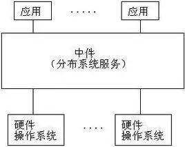
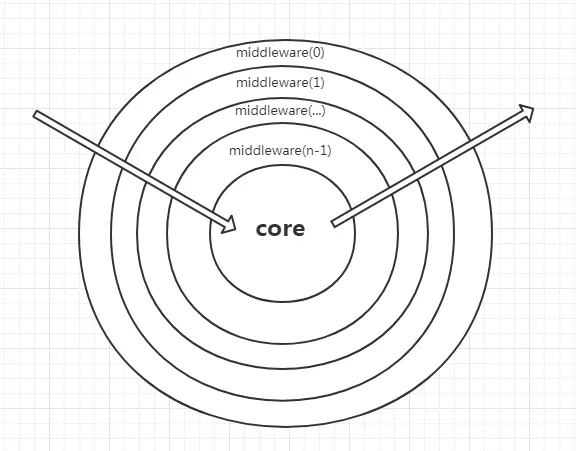

## 什么是中间件？
中间件是一种独立的系统软件或服务程序，分布式应用软件借助这种软件在不同的技术之间共享资源，中间件位于客户机/服务器的操作系统之上，管理计算机资源和网络通讯，是将两个独立应用程序或独立系统的软件相连接的系统，即使它们具有不同的接口，但通过中间件相互之间仍能交换信息。执行中间件的一个关键途径是信息传递。通过中间件，应用程序可以工作于多平台或OS环境。



## 我们的中间件实现（来自koa的洋葱模型）

koa的中间件采用的是洋葱模型,每一次对于程序的访问,都会从外向内依次经过每一个中间件,再依次由内向外。

## 如何编写一个中间件?
示例：处理http层错误报错中间件:
```typescript
import { BaseException } from '@applet-request/shared';
import { isHttpSuccess } from '@applet-request/shared';

class HttpException extends BaseException {
  name = 'HttpException';
}

/**
 * 处理http层错误报错中间件
 */
requestInstance.use(async (context, next) => {
  try {
    await next();
  }
  catch (error) {
    // 判断是否是http成功的状态
    if (!isHttpSuccess(context.response.raw.statusCode)) {
      throw new HttpException('错误，请重试！', context.response.raw);
    }
    // 不是则原错误继续向外抛出
    throw error;
  }
});
```

## 提供的API
`context`:
这里的【context】是中间件上下文，它上面挂载着请求期间的多种数据。
其类型如下：
```typescript
/**
 * 中间件上下文
 */
interface RequestContext<Config = unknown, Data = unknown, RawResponse = unknown, Instance = unknown> {
  /**
   * 请求实例
   */
  requestInstance: Instance;
  /**
   * 请求实例.request方法传入的初始配置
   */
  options: RequestConfig<Config>;
  /**
   * 请求实例内转换后的请求配置
   */
  request: TransformRequestConfig<Config>;
  /**
   * 响应相关配置
   */
  response: Response<Data, RawResponse>;
}
```

`next`:
这里的next使用控制上一个中间件的执行的，next执行前就是请求前，next执行后就是请求后。
其类型如下：
```typescript
type MiddlewareNext = () => Promise<unknown> | unknown;
```